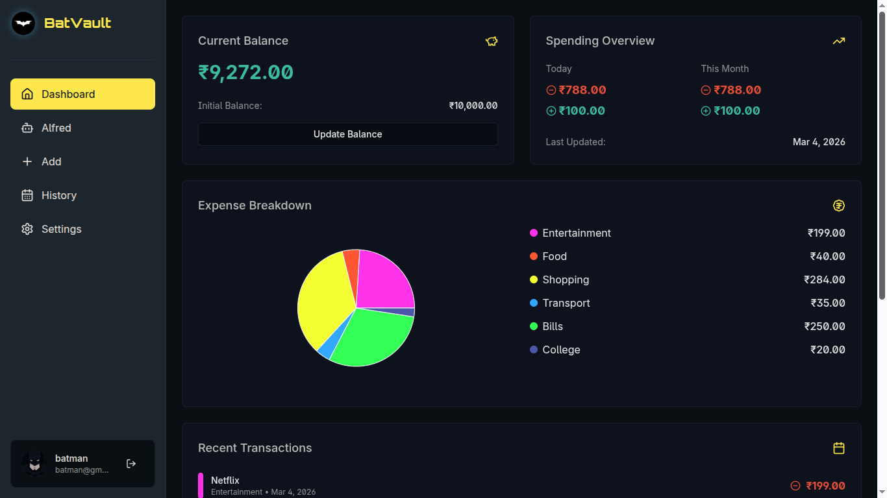
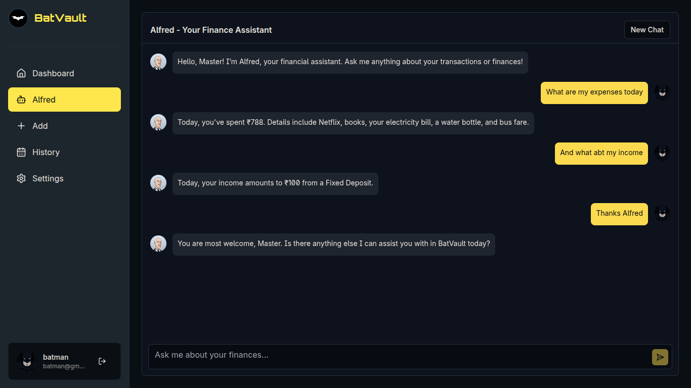
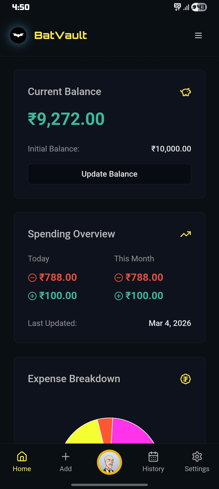
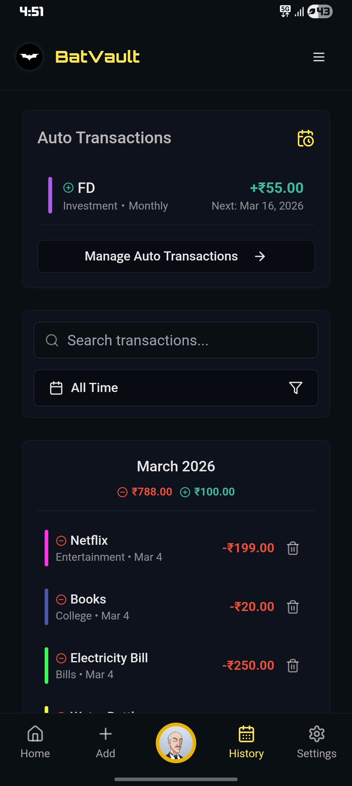

# 🦇 BatVault — Personal Finance Tracker

A sleek, AI-powered finance tracker — available as a **web app** and **Android APK**.

🌐 **Live Demo:** [batvault.netlify.app](https://batvault.netlify.app)

---

## 📸 Preview

<!-- Add your app screenshots here (place images in a previews/ folder) -->

<p align="center">
  
  <br/><b>📊 Dashboard</b>
</p>

<p align="center">
  
  <br/><b>🤖 AI Finance Assistant</b>
</p>

### 📱 Mobile App (Android APK)

<!-- PC: side by side | Mobile: one below other -->
<table align="center">
  <tr>
    <td align="center">
      <br/>
      <b>📊 Dashboard</b>
    </td>
    <td align="center">
      <br/>
      <b>📋 History</b>
    </td>
  </tr>
</table>

## ✨ Features

- 📊 Dashboard with balance overview
- ➕ Add income & expenses with categories
- 📋 Transaction history with filters
- 🔁 Recurring transactions (auto-processed)
- 🤖 AI finance assistant (Gemini-powered)
- 🔔 Smart local notifications
- 📱 Native Android app via Capacitor

---

## 🛠️ Tech Stack

React + TypeScript · Vite · Tailwind CSS · shadcn/ui · Firebase (Auth + Firestore) · Netlify Functions · Google Gemini · Capacitor (Android)

---

## 🚀 Setup

### 1. Clone & Install

```bash
git clone https://github.com/harxhith/batvault.git
cd batvault
npm install
```

### 2. Environment Variables

Create a `.env` file:

```env
VITE_FIREBASE_API_KEY=your_key
VITE_FIREBASE_AUTH_DOMAIN=your_project.firebaseapp.com
VITE_FIREBASE_PROJECT_ID=your_project_id
VITE_FIREBASE_STORAGE_BUCKET=your_project.appspot.com
VITE_FIREBASE_MESSAGING_SENDER_ID=your_sender_id
VITE_FIREBASE_APP_ID=your_app_id

VITE_GEMINI_API_KEY=your_gemini_api_key
```

> **Note:** Make sure to also add all these environment variables in your **Netlify Project Settings** before deploying.

### 3. Firebase Setup

Enable **Email/Password Auth** and create a **Firestore Database** in your Firebase project, then deploy rules:

```bash
npm install -g firebase-tools
firebase login
firebase deploy --only firestore
```

### 4. Run Locally

```bash
npm run dev            # Web app at http://localhost:8080
npx netlify dev        # With serverless functions
```

---

## 📱 Android APK

> Requires [Android Studio](https://developer.android.com/studio)

```bash
npm run build:android     # Build web + sync to Capacitor
npx cap open android      # Open in Android Studio, then build APK
```

---

## 📜 Scripts

| Command                    | Description              |
| -------------------------- | ------------------------ |
| `npm run dev`              | Start dev server         |
| `npm run build`            | Production build         |
| `npm run build:android`    | Build + sync for Android |
| `npm run cap:open:android` | Open Android Studio      |

---

## 📄 License

[MIT](LICENSE)
